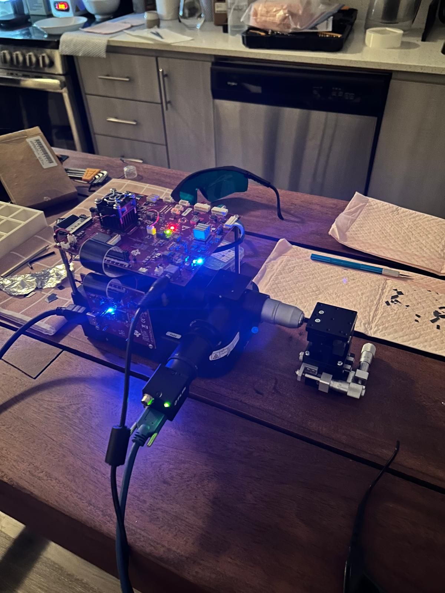
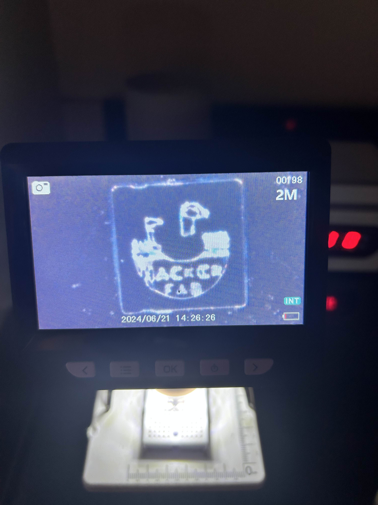
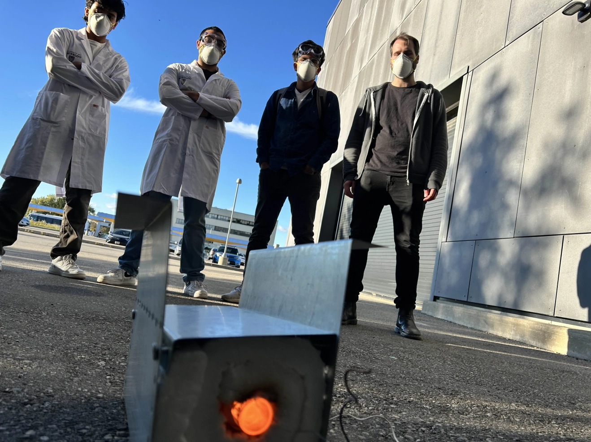
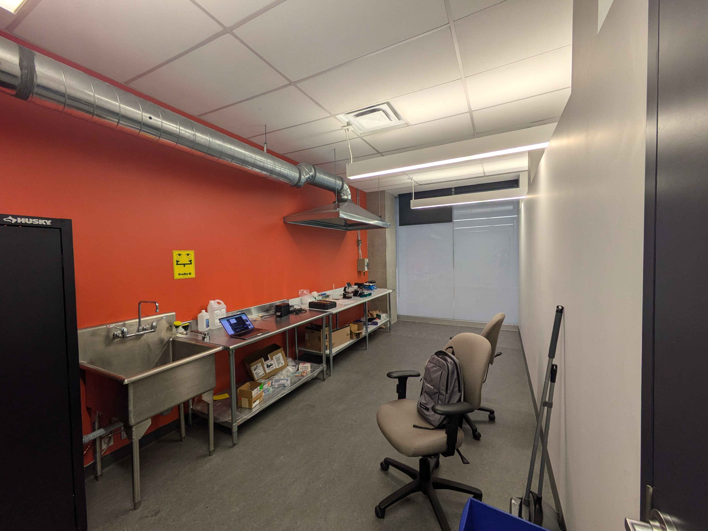
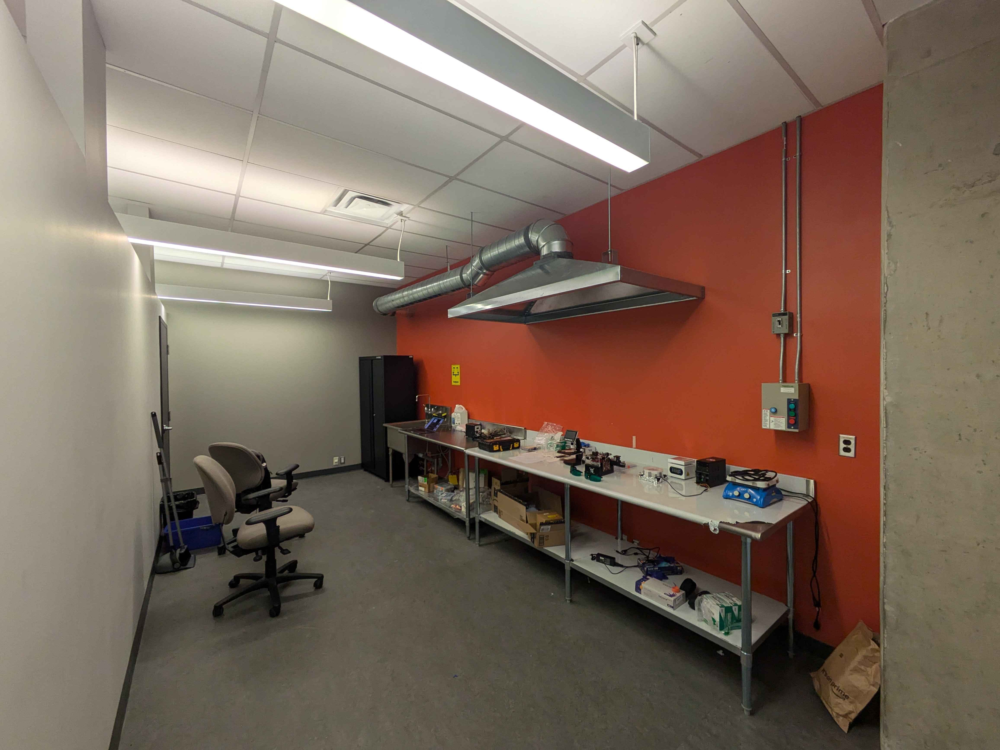

# Waterloo Hacker Fab
The open-source, student run semiconductor fab at the University of Waterloo.

We are developing affordable and accessible tools and processes for semiconductor fabrication. Part of the inter-collegiate [Hacker Fab](https://www.hackerfab.org) initiative to create a comprehensive knowledge base for nanofabrication, focusing on reproducible work that advances the field.

## Current Fab Capabilites:
- Maskless photolithography.
- Spin-coater

In-progress:
- Tube Furnace
   - Test 1 completed successfully!
- DC Sputter
- Spin-coater v2
- Stage for litho

